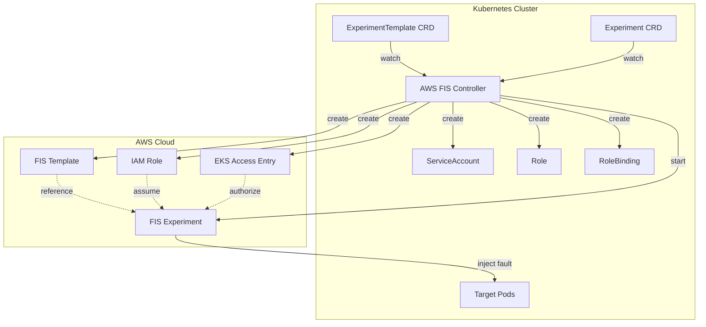
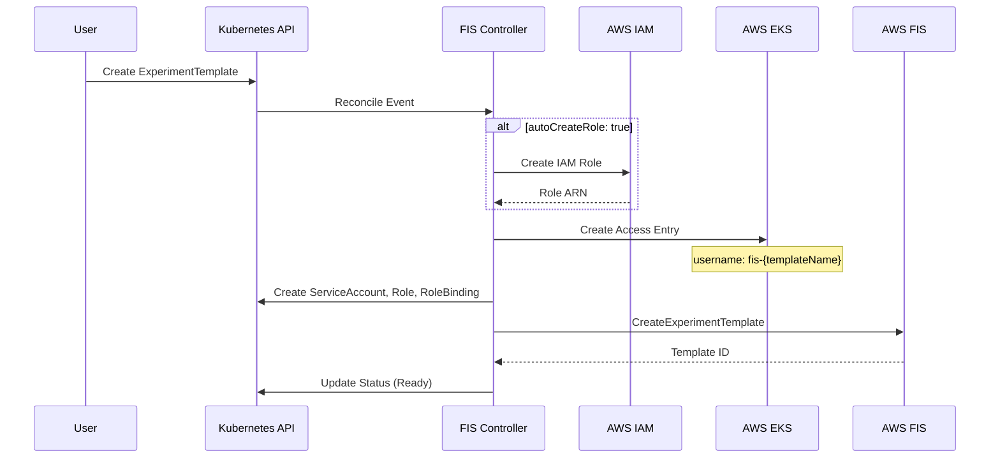
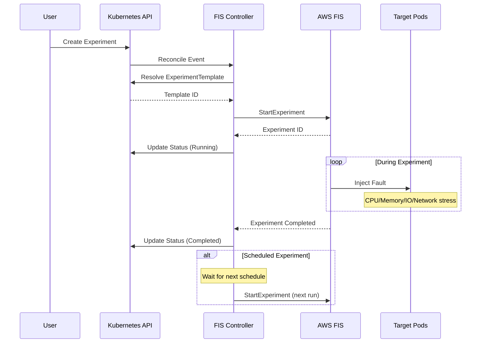

# AWS FIS Controller for Kubernetes

A Kubernetes controller that manages AWS Fault Injection Service (FIS) experiments through Custom Resource Definitions (CRDs). This controller enables GitOps-style chaos engineering by allowing you to define and manage FIS experiments as Kubernetes resources.

## Overview

AWS FIS Controller bridges the gap between Kubernetes and AWS FIS, providing:

- Declarative management of FIS experiment templates via Kubernetes CRDs
- Automatic IAM role creation and EKS access entry configuration
- Support for one-time and scheduled chaos experiments
- Full lifecycle management (create, update, delete) synchronized with AWS FIS

## Features

- ExperimentTemplate CRD: Define AWS FIS experiment templates as Kubernetes resources
- Experiment CRD: Run experiments on-demand or on a schedule (cron-based)
- Automatic IAM Role Management: Optionally auto-create IAM roles with required permissions
- EKS Access Entry: Automatically configure EKS access entries for FIS to access your cluster
- Kubernetes RBAC: Auto-provision ServiceAccount, Role, and RoleBinding for FIS operations
- Flexible Target Selection: Support for ALL, COUNT(n), or PERCENT(n%) pod selection

## Prerequisites

- Kubernetes cluster v1.24+
- AWS EKS cluster with API access mode enabled
- kubectl configured to access your cluster
- AWS credentials with permissions for FIS, IAM, and EKS operations
- Go 1.24+ (for development)

## Installation

### Option 1: Deploy using Helm (Recommended)

```bash
# Install from local chart
helm install aws-fis-controller ./dist/chart \
  --namespace aws-fis-controller-system \
  --create-namespace \
  --set clusterName=<eks-cluster-name> \
  --set controllerManager.container.image.repository=<your-registry>/aws-fis-controller \
  --set controllerManager.container.image.tag=latest
```

#### Helm Values

| Parameter | Description | Default |
|-----------|-------------|---------|
| `clusterName` | EKS cluster name (Required) | `""` |
| `controllerManager.replicas` | Number of controller replicas | `1` |
| `controllerManager.container.image.repository` | Controller image repository | `controller` |
| `controllerManager.container.image.tag` | Controller image tag | `latest` |
| `controllerManager.container.imagePullPolicy` | Image pull policy | `IfNotPresent` |
| `controllerManager.container.args` | Additional controller arguments | `["--leader-elect", "--metrics-bind-address=:8443", "--health-probe-bind-address=:8081"]` |
| `controllerManager.container.resources.limits.cpu` | CPU limit | `500m` |
| `controllerManager.container.resources.limits.memory` | Memory limit | `128Mi` |
| `controllerManager.container.resources.requests.cpu` | CPU request | `10m` |
| `controllerManager.container.resources.requests.memory` | Memory request | `64Mi` |
| `rbac.enable` | Enable RBAC resources | `true` |
| `crd.enable` | Install CRDs with chart | `true` |
| `crd.keep` | Keep CRDs on uninstall | `true` |
| `metrics.enable` | Enable metrics export | `true` |
| `prometheus.enable` | Enable ServiceMonitor for Prometheus | `false` |

#### Custom Values File

Create a custom values file for your environment:

```yaml
# my-values.yaml
clusterName: my-eks-cluster

controllerManager:
  replicas: 2
  container:
    image:
      repository: 123456789012.dkr.ecr.ap-northeast-2.amazonaws.com/aws-fis-controller
      tag: v1.0.0
    resources:
      limits:
        cpu: 1000m
        memory: 256Mi
      requests:
        cpu: 100m
        memory: 128Mi
```

```bash
helm install aws-fis-controller ./dist/chart \
  --namespace aws-fis-controller-system \
  --create-namespace \
  -f my-values.yaml
```

#### Upgrade

```bash
helm upgrade aws-fis-controller ./dist/chart \
  --namespace aws-fis-controller-system \
  -f my-values.yaml
```

#### Uninstall

```bash
helm uninstall aws-fis-controller --namespace aws-fis-controller-system
```

### Option 2: Deploy using Kustomize

```bash
# Install CRDs
make install

# Deploy controller (replace with your image)
make deploy IMG=<your-registry>/aws-fis-controller:latest
```

### Required Controller Flags

```bash
--cluster-name=<eks-cluster-name>  # Required: EKS cluster name for access entry management
```

## Usage

### ExperimentTemplate

Define an experiment template to specify what chaos actions to perform:

```yaml
apiVersion: fis.fis.dksshddl.dev/v1alpha1
kind: ExperimentTemplate
metadata:
  name: disk-stress-experiment
  namespace: default b
spec:
  description: "Inject disk I/O stress on nginx pods"
  
  # Option 1: Provide your own IAM role (recommended for production)
  # roleArn: arn:aws:iam::123456789012:role/MyFISRole
  
  # Option 2: Auto-create IAM role (opt-in)
  autoCreateRole: true
  
  targets:
  - name: nginx-pods
    namespace: default
    labelSelector:
      app: nginx
    scope: "50%"  # Options: "ALL", "3" (count), "50%" (percent)
  
  actions:
  - name: io-stress
    type: pod-io-stress
    duration: 5m
    target: nginx-pods
    parameters:
      percent: "80"
  
  stopConditions:
  - source: none
```

### Experiment

Run experiments either immediately or on a schedule:

```yaml
# One-time experiment (runs immediately)
apiVersion: fis.fis.dksshddl.dev/v1alpha1
kind: Experiment
metadata:
  name: onetime-stress-test
spec:
  experimentTemplate:
    name: "disk-stress-experiment"

---
# Scheduled experiment (runs daily at 2am)
apiVersion: fis.fis.dksshddl.dev/v1alpha1
kind: Experiment
metadata:
  name: scheduled-stress-test
spec:
  experimentTemplate:
    name: "disk-stress-experiment"
  schedule: "0 2 * * *"
  successfulExperimentsHistoryLimit: 3
  failedExperimentsHistoryLimit: 1
```

### Supported Action Types

| Action Type | Description |
|-------------|-------------|
| pod-cpu-stress | Inject CPU stress on target pods |
| pod-memory-stress | Inject memory stress on target pods |
| pod-io-stress | Inject disk I/O stress on target pods |
| pod-network-latency | Add network latency to target pods |
| pod-network-packet-loss | Inject packet loss on target pods |
| pod-delete | Delete target pods |

### Target Scope Options

The `scope` field supports three formats:

- `"ALL"` - Target all matching pods (default)
- `"3"` - Target exactly 3 pods (COUNT mode)
- `"50%"` - Target 50% of matching pods (PERCENT mode)

## IAM Role Configuration

### Option 1: User-Provided Role (Recommended)

Provide your own IAM role with the required FIS permissions:

```yaml
spec:
  roleArn: arn:aws:iam::123456789012:role/MyFISRole
```

### Option 2: Auto-Created Role

Let the controller create and manage the IAM role:

```yaml
spec:
  autoCreateRole: true
  roleName: my-custom-role-name  # Optional, defaults to fis-{namespace}-{name}
```

The auto-created role includes permissions for:
- EKS pod fault injection actions
- CloudWatch Logs (if log configuration is specified)
- S3 (if S3 configuration is specified)

## Architecture

### Overall Flow



### ExperimentTemplate Lifecycle



### Experiment Execution Flow



When an ExperimentTemplate is created:
1. Controller creates/validates IAM role
2. Creates EKS access entry with username `fis-{templateName}`
3. Creates Kubernetes RBAC resources (ServiceAccount, Role, RoleBinding)
4. Creates AWS FIS experiment template

## Development

### Build

```bash
make build
```

### Run locally

```bash
make run ARGS="--cluster-name=my-eks-cluster"
```

### Run tests

```bash
make test
```

### Build and push container image

```bash
make docker-build docker-push IMG=<registry>/aws-fis-controller:<tag>
```

## Uninstallation

### If installed with Helm

```bash
# Delete all experiments and templates first
kubectl delete experiments --all -A
kubectl delete experimenttemplates --all -A

# Uninstall Helm release
helm uninstall aws-fis-controller --namespace aws-fis-controller-system

# Delete namespace (optional)
kubectl delete namespace aws-fis-controller-system

# Remove CRDs (if crd.keep was true)
kubectl delete crd experiments.fis.fis.dksshddl.dev
kubectl delete crd experimenttemplates.fis.fis.dksshddl.dev
```

### If installed with Kustomize

```bash
# Delete all experiments and templates
kubectl delete experiments --all -A
kubectl delete experimenttemplates --all -A

# Remove controller
make undeploy

# Remove CRDs
make uninstall
```
## License

Copyright 2026.

Licensed under the Apache License, Version 2.0 (the "License");
you may not use this file except in compliance with the License.
You may obtain a copy of the License at

    http://www.apache.org/licenses/LICENSE-2.0

Unless required by applicable law or agreed to in writing, software
distributed under the License is distributed on an "AS IS" BASIS,
WITHOUT WARRANTIES OR CONDITIONS OF ANY KIND, either express or implied.
See the License for the specific language governing permissions and
limitations under the License.
